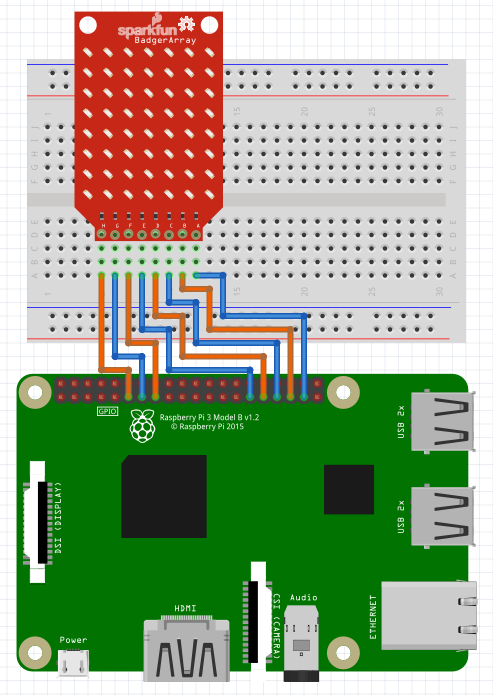

# pythonic-charlieplex
Python class for controlling SparkFun 8x7 LED Array with the Raspberry Pi utilizing `RPi.GPIO` (https://pypi.python.org/pypi/RPi.GPIO).

This is a single-file class written in Python 3 for controlling the the SparkFun 8x7 LED Array 
(https://www.sparkfun.com/products/13795) that is controlled by eight charlieplexed pins. 

V0.0.0 is fully compatiable with the latest versions of both Python 2 and Python 3. It has been tested on the latest version of Raspbian Jesse, but should work with any Raspberry Pi Linux distro with `RPi.GPIO` installed.  

For instructions on how to wire your LED array and see how charlieplexing works, see SparkFun's excellent hookup guide to the LED array here: https://learn.sparkfun.com/tutorials/sparkfun-led-array-8x7-hookup-guide

#Repository Contents
* **charlie.py** - source file for class `Charlie`
* **/examples** - code examples utilizing `charlie.py` (currently being expanded)
* **README.md** - this file

#Documentation

###Installing

Here are three ways to convienently get pythonic-charlieplex usable on your Raspberry Pi:

1. **Copy and paste contents of `charlie.py` into existing code:** the class `Charlie` is short enough that you can 
easily paste it directly into your Python script. 

2. **Place the file `charlie.py` in the same directory as your script:** Placing the `charlie.py` file in within your script will 
enable you to call `import charlie` in your code.

3. **Copy `charlie.py` into directories `usr/lib/python2.7/dist-packages` and `usr/lib/python3/dist-packages`:** simply copy the
`charlie.py` file into the Python dist-packages directories. Any script locally run on your Raspberry Pi will then be able to 
`import charlie`.

###Wiring

In order to use the array with the Raspberry Pi, connect pins A-H to the GPIO. There's no need to add current-impeding resistors, as the LED array has them built in! An example layout on a breadboard is shown below. 

###Help on `charlie.py`

For help on the usage of `charlie.py`, see `/examples`. For documentation on the methods of the `Charlie` class once `charlie.py` is installed, type `import charlie` and then `help(Charlie)` into the Python shell.

See `/examples` to see usage of `charlie.py`.

#License

This software is open source! Released under the MIT license. See LICENSE.txt for full details.

Initial release: 18-Jun-2016
